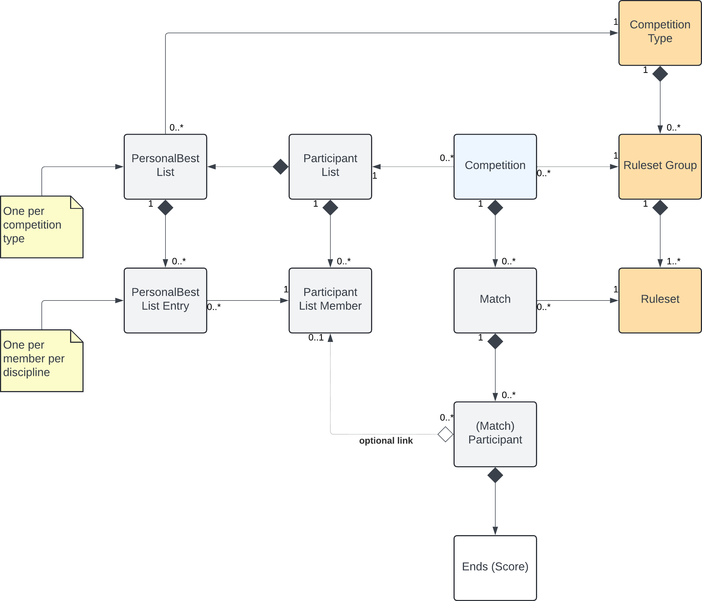

# Design for CentaurScores backend

The design for the Centaur Scores backend is quite straightforward.

## The concepts:
- There is no need to register beforehand to join a match
- Matches exist in the context of competitions only, and competitions can consist of one or more matches.
- Competitions refer to lists of officially registered members in the form of "participant lists". 
    - For officially registered members, additional data is kept such as their personal best scores per discipline
    - Anyone can join a match, you do not have to be officially registered for that. Just enter your name, discipline and age group on the fly.
    - All match participants can be linked to offically registered members later by the match administrator. 
    - If need be, unregistered members can be registered on the fly.
- Matches have results, competitions also have results

## Data model design 

- CompetitionEntity represents a competition and defines metadata such as the name, start date and end date. 
    - CompetitionEntity refers to a ParticipantListEntity
    - CompetitionEntity owns zero or more MatchEntity objects
    - CompetitionEntity refers to a "ruleset group"
    - MatchEntity represents a match
        - MatchEntity owns a set of ParticipantEntity objects
        - MatchEntity refers to a single "ruleset" in the competition's "ruleset group"
        - MatchEntity is owned by a CompetitionEntity
        - MatchEntity defines the properties of a match, such as the number of ends, arrows per end, targets etc.
        - ParticipantEntity represents a single participant in a match
            - ParticipantEntity defines the name, discipline, age group and target choice.
            - ParticipantEntity contains all end and arow scores for the archer in this match
            - ParticipantEntity contains information about the score entry device used, and the 'relative position' of the archer.
            - ParticipantEntity can optionally be linked to a ParticipantListEntryEntity
ParticipantListEntity represents a list of possible participants, such as everyone who registered online or the list of members of the shooting range.
    - ParticipantListEntity contains metadata on the list, such as its name
    - ParticipantListEntity owns one or more ParticipantListEntryEntity oobject, each representing a list member
    - ParticipantListEntity optionally owns one or more PersonalBestListEntities representing categories in which for this partitipant list personal best records are kept.
    - ParticipantListEntryEntity defines all relevant metadata for a list member
        - ParticipantListEntryEntity defines NAme, Disciplne, AgeGroup, and a IsDeactivated flag 
        - ParticipantListEntryEntity owns a list of PersonalBestsListEntryEntity objects, one for each discipline+competitiontype for which the archer registered their official scores.
    - PersonalBestListEntity obejcts define a name and a match category (ruleset related) for which personal best scores are kept.

## Rulesets

In the CompetitionLogic namespace, additional clases can be added that implement the "IRuleService.cs" interface. Classes that implement this interface offer logic to calculate competition scores and single match scores for a competition/match. Also each rule service will define one or more competition rules, returned by GetSupportedRulesets().

A ruleset definition contains some important properties:
- CompetitionFormat uniquely identifies the competition format + parameters in a single string. Used for personal best lists.
- Only rulesets that share a GroupName can be combined within a single competition
- Code is used to uniquely identify this ruleset in a match

So, basically we would have a competition format set up as follows (example):
- CompetitionFormat: Indoor 18m3p, 30 pijlen
- GroupName: Indoor 18m3p, 25m3p
- Code: 18m3p or 25m3p
- Name: "Indoor 18m3p, 30 pijlen" or "Indoor 25m3p, 30 pijlen"

## Adding rulesets

A module adding a ruleset should basically just implement the IRulesetService interface. The first 5 standard rulesets all share a superclass because their scoring logic is basically the same. This is not required though.

## Devices

The client for tablet devices has some special APIs that help it function. These will for example return matches with 4 participants, some of which may not be used yet.

## Personal bests

These are kept (per participant list, per competition format, per ruleset, per discipline)

## Accounts and ACLs

It's actually already possible to create accounts and ACLs manually via the database.
An ACL is no more than a name, with a list of accounts that get access through this ACL.
Use the AuthenticationController to log in using the /auth/login endpoint, this yields a bearer token.
Use the whoami endpoint to check that authentication succeeded.

## Data model

The name participant list was not chosen well, it's easy to confuse this with match participants, and even though there is an indirect link between the two, match participants really are their own entity aggregated from match.
